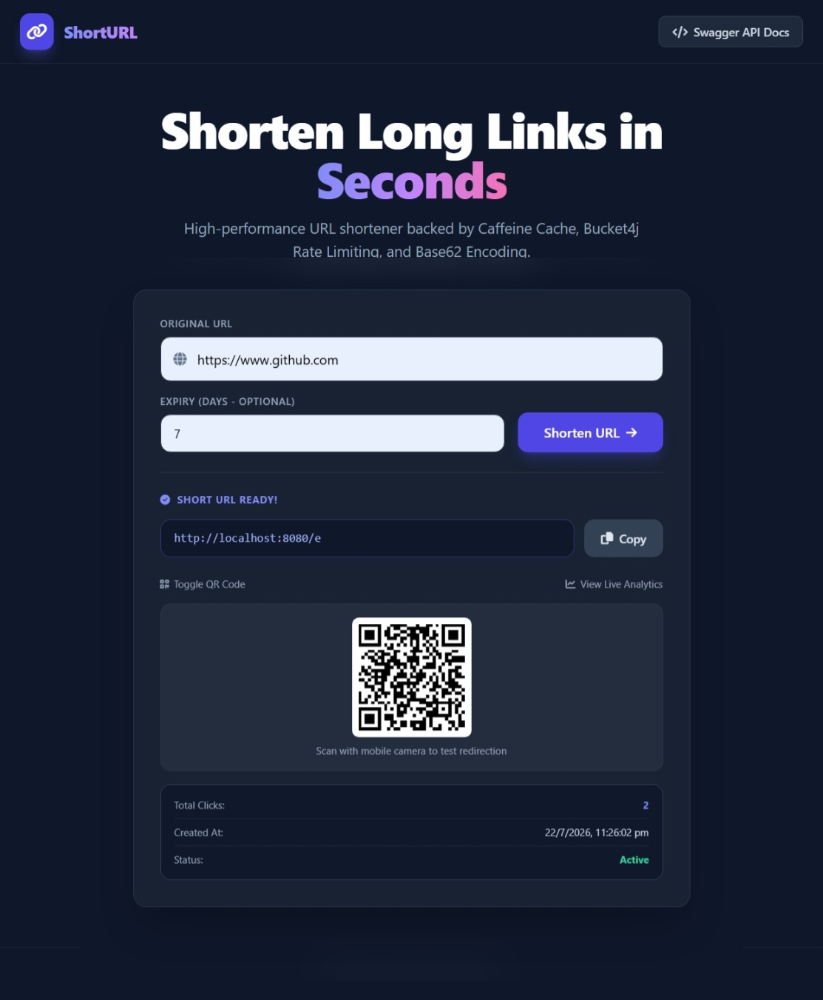
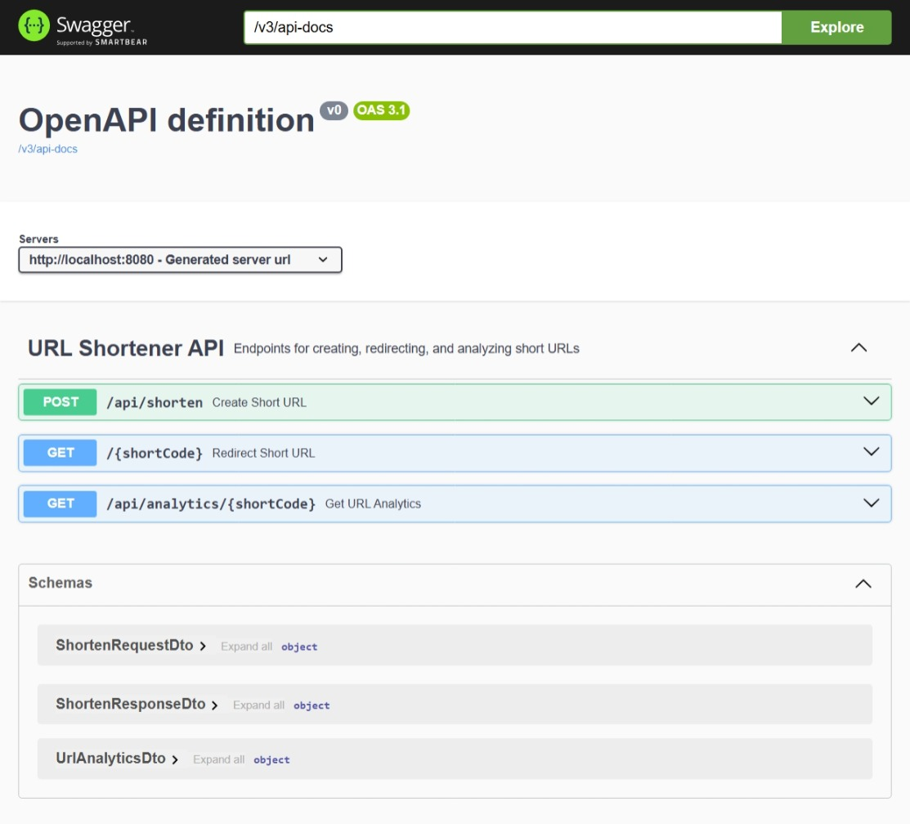

<div align="center">

# 🔗 High-Performance URL Shortener & Analytics Service

An enterprise-grade, ultra-fast URL Shortener & Real-Time Analytics Platform built using Spring Boot 3, MySQL, Caffeine Cache, Bucket4j, and Tailwind CSS.

[](https://www.oracle.com/java/)
[](https://spring.io/projects/spring-boot)
[](https://www.mysql.com/)
[](https://tailwindcss.com/)
[](LICENSE)

</div>

---

## 📌 Table of Contents
- [Overview](#-overview)
- [Key Features](#-key-features)
- [Tech Stack](#-tech-stack)
- [Architecture & System Flow](#-architecture--system-flow)
- [Project Structure](#-project-structure)
- [Getting Started](#-getting-started)
    - [Prerequisites](#prerequisites)
    - [Database Configuration](#database-configuration)
    - [Build and Run](#build-and-run)
- [API Documentation](#-api-documentation)
- [Screenshots & UI Showcase](#-screenshots--ui-showcase)
- [Contributing](#-contributing)
- [Future Enhancements](#-future-enhancements)
- [License](#-license)

---

## 🌐 Overview

The **URL Shortener & Analytics Service** is designed to transform long, messy URLs into clean, short links while providing real-time click tracking, anti-spam rate limiting, dynamic TTL expiration, and auto-generated QR codes.

By combining **Base62 Encoding** with **Caffeine In-Memory Caching (`@CachePut`)**, the application handles ultra-low latency link redirections with high throughput capability.

---

## ✨ Key Features

* ⚡ **Sub-Millisecond Redirection:** Powered by Base62 Encoding and Caffeine Caching for instant 302 HTTP redirects.
* 🔒 **API Rate Limiting:** Implements Bucket4j Token-Bucket algorithm to safeguard endpoints against spam and DDoS attacks.
* ⌛ **Dynamic Link Expiration (TTL):** Supports customizable link lifetimes (e.g., 7 days, 30 days, or custom expiration).
* 📈 **Real-time Click Analytics:** Accurately increments and fetches total clicks and active status dynamically synced via `@CachePut`.
* 📱 **Live QR Code Generation:** Instant front-end QR rendering using QRCode.js for seamless mobile scanning.
* 🎨 **Modern Dark Glassmorphism UI:** Fully responsive dashboard built with Tailwind CSS and FontAwesome embedded natively.
* 📄 **OpenAPI / Swagger Integration:** Interactive API documentation available out-of-the-box.

---

## 🛠️ Tech Stack

### **Backend Frameworks & Tools**
* **Language:** Java 17
* **Framework:** Spring Boot 3.x (Spring Web, Spring Data JPA)
* **Database:** MySQL 8.0
* **Caching:** Caffeine Cache
* **Rate Limiting:** Bucket4j
* **API Documentation:** Springdoc OpenAPI / Swagger UI
* **Build Tool:** Apache Maven

### **Frontend & UI**
* **Core:** HTML5, Modern JavaScript (ES6)
* **Styling:** Tailwind CSS (via CDN)
* **Icons:** FontAwesome
* **QR Generation:** QRCode.js

---

## 🏗️ Architecture & System Flow

```
               +----------------------------------+
               |      Client (Browser / Mobile)    |
               +----------------+-----------------+
                                |
                                | HTTP Requests (UI / REST API)
                                v
               +----------------------------------+
               |      Spring Boot Application     |
               +----------------+-----------------+
                                |
                +---------------+---------------+
                |                               |
                v                               v
    +-----------------------+       +-----------------------+
    | Bucket4j Rate Limiter |       | Base62 Short Encoder  |
    +-----------------------+       +-----------------------+
                |                               |
                +---------------+---------------+
                                |
                                v
               +----------------------------------+
               | UrlMappingServiceImpl (@CachePut)|
               +----------------+-----------------+
                                |
                +---------------+---------------+
                |                               |
                v                               v
    +-----------------------+       +-----------------------+
    | Caffeine In-Mem Cache |       |    MySQL Database     |
    |  (Fast Read / Sync)   |       | (Persistent Storage)  |
    +-----------------------+       +-----------------------+
```
---

## 🚀 Getting Started

### Prerequisites

Ensure you have the following installed on your machine:
* **Java Development Kit (JDK 17+)**
* **Apache Maven 3.8+**
* **MySQL Database Server (v8.0+)**
* **Git**

### Clone Repository

```bash
git clone [https://github.com/Govind-2401/url-shortener-service.git](https://github.com/Govind-2401/url-shortener-service.git)
cd url-shortener-service
```

### Configure Database

Update the following properties in `application.properties`:

```properties
spring:
 datasource:
   url: jdbc:mysql://localhost:3306/urlshortener?useSSL=false&serverTimezone=UTC
   username: YOUR_MYSQL_USERNAME
   password: YOUR_MYSQL_PASSWORD
 ```
### Build and Run the Project

```bash
mvn clean package -DskipTests
mvn spring-boot:run
```
### Access the Application:

Web Dashboard: http://localhost:8080/

Swagger API Docs: http://localhost:8080/swagger-ui/index.html

---

## 📌 Key API Endpoints

### Endpoints Overview

| Method | Endpoint | Description |
| :--- | :--- | :--- |
| `POST` | `/api/shorten` | Creates a short code for a given long URL with optional expiration days (TTL). |
| `GET` | `/{shortCode}` | Performs a 302 HTTP Redirect to the original URL and increments click count. |
| `GET` | `/api/analytics/{shortCode}` | Retrieves total click count, creation timestamp, dynamic status, and expiration info. |

---

### Request Payload Example (`POST /api/shorten`)

```json
{
  "originalUrl": "[https://github.com/Govind-2401/url-shortener-service](https://github.com/Govind-2401/url-shortener-service)",
  "daysToExpire": 30
}
```

### Response Example (`200 OK`)

```json
{
  "id": 1,
  "originalUrl": "[https://github.com/Govind-2401/url-shortener-service](https://github.com/Govind-2401/url-shortener-service)",
  "shortCode": "b",
  "clickCount": 0,
  "expiryDate": "2026-08-22T00:00:00"
}
```
---
## 📸 Screenshots & UI Showcase

### 1. Main Dashboard
The modern dark Glassmorphism dashboard where users input long URLs and optional TTL expiration days.


---

### 2. Generated Short URL, QR Code & Live Analytics
Displays the generated short link, interactive mobile QR code, click tracking counter, and active status dynamically.



---

### 3. Swagger API Documentation (OpenAPI 3.1)
Interactive Swagger UI listing all endpoints (`/api/shorten`, `/{shortCode}`, `/api/analytics/{shortCode}`) and data schemas for easy testing.



---

## 🤝 Contributing

Contributions are what make the open-source community such an amazing place to learn, inspire, and create. Any contributions you make are **greatly appreciated**!

If you have a suggestion that would make this better, please fork the repo and create a pull request. You can also simply open an issue with the tag "enhancement".

1. **Fork the Project**
2. **Create your Feature Branch**
   ```bash
   git checkout -b feature/AmazingFeature
   ```
   Commit your Changes
   ```bash
   git commit -m "feat: add some AmazingFeature"
   ```
   Push to the Branch
   ```bash
   git push origin feature/AmazingFeature
   ```
   Open a Pull Request
---

## 🔮 Future Enhancements

Planned features and improvements for future releases:

* **🔐 User Authentication & Custom Dashboard:** Integration of Spring Security & JWT to allow users to sign up, manage, and delete their generated short links.
* **🏷️ Custom Slug Creation:** Option for users to specify custom alias/vanity URLs (e.g., `http://localhost:8080/my-custom-link`).
* **🌍 Advanced Analytics & Geolocation Tracking:** Detailed insights including visitor country, browser/device type, and hourly click distributions.
* **📦 Distributed Caching (Redis):** Replacing Caffeine in-memory cache with Redis to support multi-node microservices deployment.
* **🐳 Dockerization & Cloud Deployment:** Containerizing the application using Docker and setting up CI/CD pipelines for deployment on cloud platforms (AWS / Render).
---

## 📄 License

Distributed under the **MIT License**. See the [LICENSE](LICENSE) file for more information.

---

<div align="center">

Made with ❤️ by **[Govind](https://github.com/Govind-2401)**

</div>